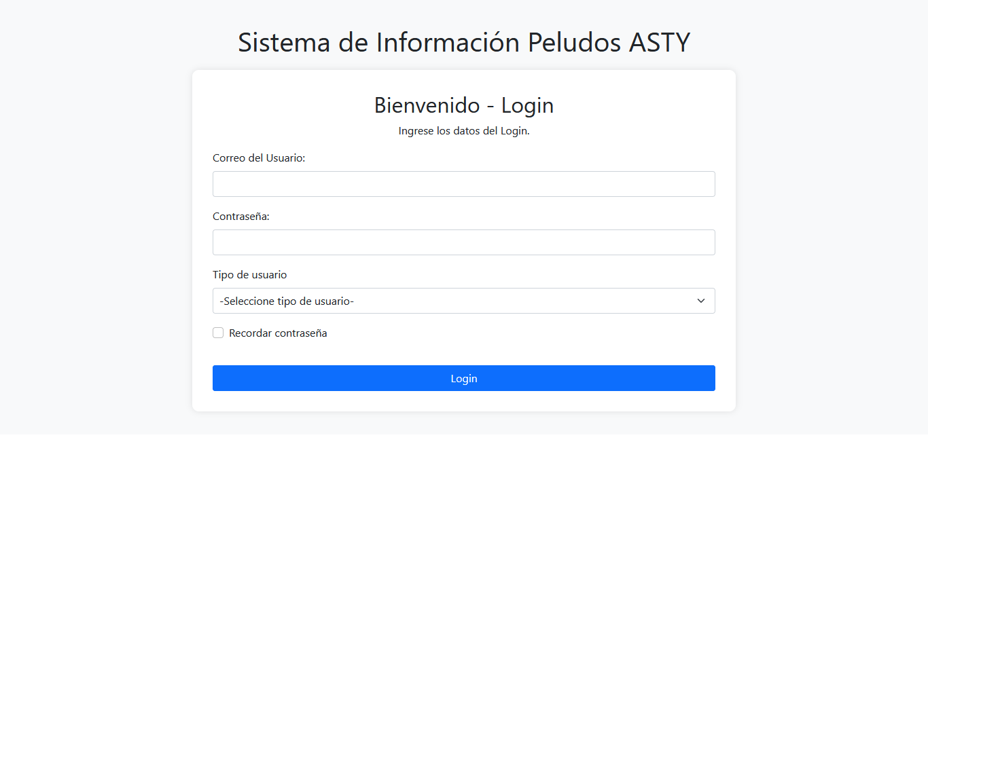
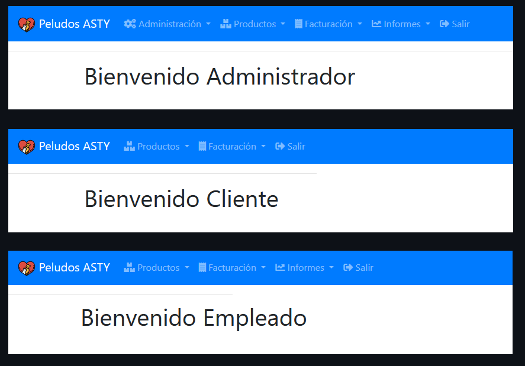
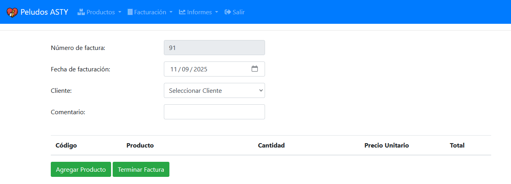
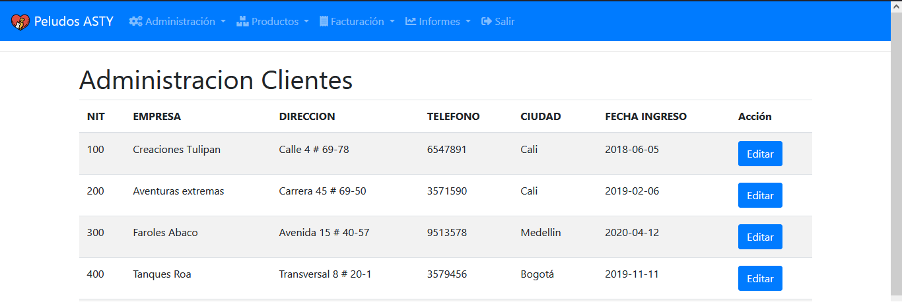
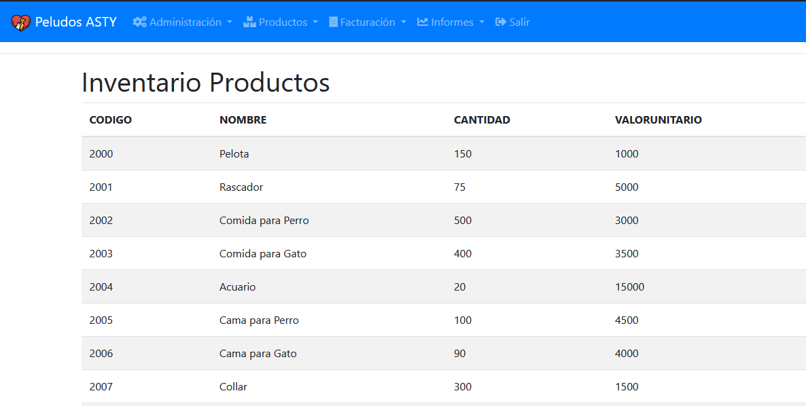
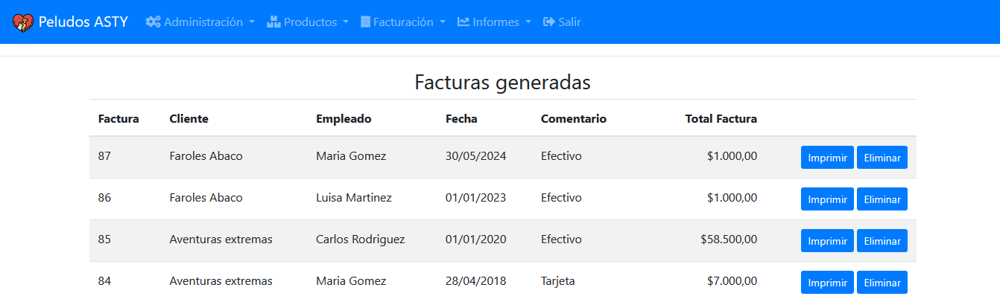

# 🐾 Pet Store Management System

A web application built with PHP for managing clients, products, suppliers, and sales in a pet store.  
It includes PDF report generation, user authentication, and dynamic menus for different roles (Admin, Employee, Client).

---

## 🚀 Features

- 🔐 Login and session control (Admin, Employee, Client)

- 🧾 Sales management with PDF invoice generation (via FPDF)
- 📦 Inventory control for products and suppliers
- 🐕 Client management
- 📊 Sales reports and graphical summaries
- 🎨 Responsive interface using Bootstrap

---

## 🖼️ Screenshots

Here are some previews of the system interface:

### 🔐 Login Page


### 🏠 Main Dashboard


### 🧾 Sales Module


### 🐕 Client Management


### 📦 Product Inventory


### 📄 PDF Report Example


---
## ⚙️ Requirements

- **PHP 8.x**
- **MySQL 5.7+**
- **Apache server** (XAMPP, WAMP, Laragon, etc.)

---

## 🧩 Installation

1. **Clone this repository**
```bash
   git clone https://github.com/Mucca03/proyAppsMascotas.git
```

2. **Clone this repository**
```bash
mysql -u root -p < database/tienda_mascotas.sql
```

3. Set up your database connection
```bash
cp ConfiguracionBD/ConexionBD.php.example ConfiguracionBD/ConexionBD.php
```
Then edit `ConexionBD.php` and add your local database credentials.

4. Run the app
```bash
htdocs/proyAppsMascotas/
```
And open
```bash
http://localhost/proyAppsMascotas/index.php
```

